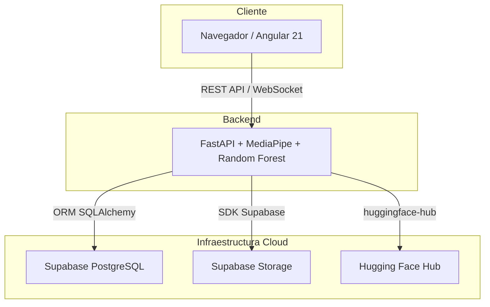
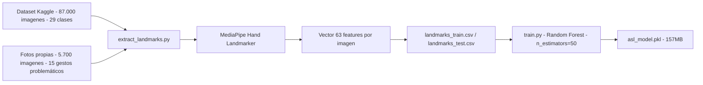
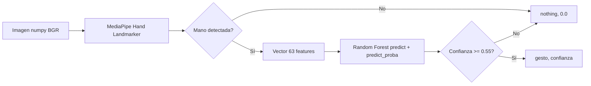
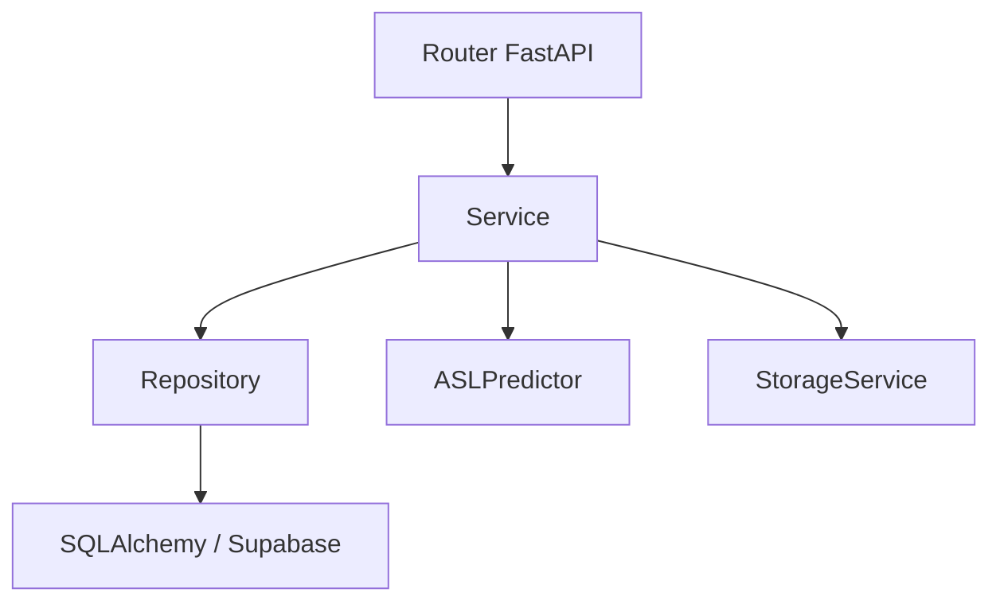
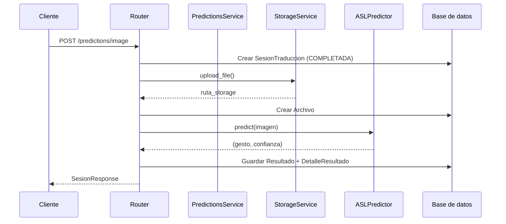
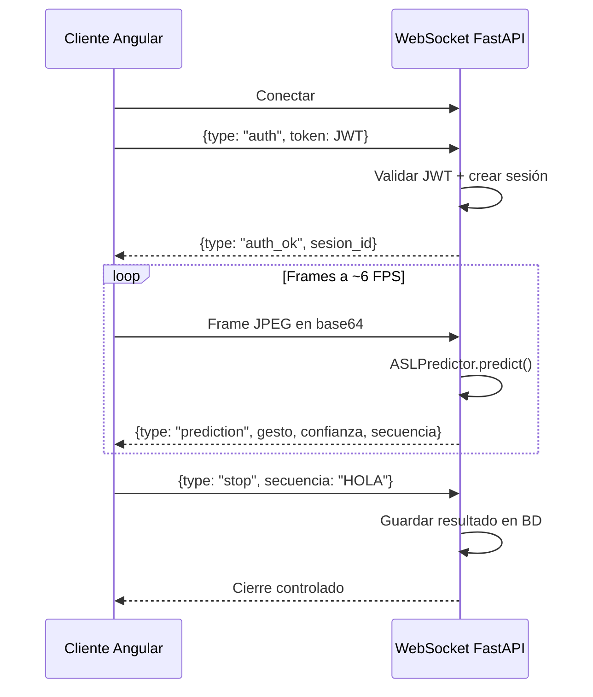
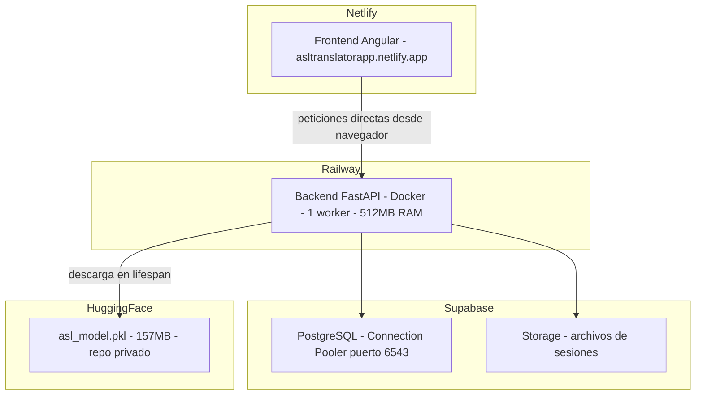

# Arquitectura del Sistema — ASL Sign Language Translator

## 1. Visión General

ASL Sign Language Translator es una aplicación web para la traducción de lenguaje de signos americano (ASL) mediante inteligencia artificial. El sistema permite traducir gestos a texto a través de imágenes, vídeos y sesiones en directo con cámara web.

El objetivo final del proyecto es la integración del modelo de traducción en plataformas de videollamada como Microsoft Teams o Zoom, habilitando subtítulos ASL en tiempo real. La aplicación web actúa como prototipo funcional que valida el pipeline completo — modelo, backend y tiempo real — con usuarios reales antes de dar ese paso.

---

## 2. Diagrama de Arquitectura General



El navegador es el único cliente. Las peticiones al backend (REST y WebSocket) se realizan directamente desde el navegador — el frontend estático en Netlify no actúa como intermediario.

---

## 3. Stack Tecnológico

### 3.1 Machine Learning

| Tecnología | Versión | Uso |
|---|---|---|
| Python | 3.12.9 | Entorno compartido (`requirements-ml.txt`) |
| MediaPipe | 0.10.33+ | Extracción de landmarks de la mano (21 puntos × 3 coordenadas = 63 features) |
| Scikit-learn | 1.8.0 | Clasificador Random Forest |
| OpenCV | 4.13.0.92 | Procesamiento de imágenes y vídeo |
| Joblib | 1.5.3 | Serialización del modelo `.pkl` |
| pandas | 3.0.2 | Manipulación de datos |
| numpy | 2.4.4 | Manipulación de datos |
| matplotlib | 3.10.9 | Visualizaciones EDA |
| seaborn | 0.13.2 | Visualizaciones EDA |
| pillow | 12.2.0 | Manipulación de imágenes |
| pytest | 8.3.4 | Testing con Python |

### 3.2 Backend

| Tecnología | Versión | Uso |
|---|---|---|
| Python | 3.12.9 | Entorno compartido (`requirements-backend.txt`) |
| FastAPI | 0.115.6 | Framework API REST + WebSocket |
| SQLAlchemy | 2.0.36 | ORM async |
| asyncpg | 0.30.0 | Driver PostgreSQL async |
| Alembic | 1.14.0 | Migraciones de base de datos |
| passlib + bcrypt | bcrypt 4.0.1 | Hash de contraseñas |
| python-jose | 3.3.0 | JWT (access + refresh con `jti`) |
| hashlib SHA-256 | — | Hash de refresh tokens |
| python-multipart | 0.0.20 | Recepción de archivos |
| python-magic | 0.4.27 | Validación de tipo MIME real |
| pydantic-settings | 2.7.0 | Configuración via `.env` |
| pydantic[email] | 2.13.3 | Validación de email |
| supabase | 2.10.0 | Cliente Supabase Storage |
| httpx | >=0.26,<0.28 | Cliente HTTP |
| huggingface-hub | >=0.23,<1.0 | Descarga del modelo en producción |
| slowapi | 0.1.9 | Rate limiting |
| Docker | 4.55.0 | Contenedorización para Railway |

### 3.3 Frontend

| Tecnología | Versión | Uso |
|---|---|---|
| Angular | 21 | Framework principal. Componentes standalone, sin NgModules |
| TypeScript | ~5.9.2 | Lenguaje principal |
| Tailwind CSS | v3 | Estilos utilitarios |
| ng2-charts + chart.js | 10.0.0 + 4.5.1 | Gráficas en dashboard admin |
| ngx-toastr | >=20.0.5 | Notificaciones toast |
| RxJS | ~7.8.0 | Manejo de streams WebSocket |

### 3.4 Infraestructura

| Servicio | Uso |
|---|---|
| Supabase | PostgreSQL (base de datos) + Storage (archivos) |
| Railway | Despliegue del backend (512MB RAM, Starter plan) |
| Netlify | Despliegue del frontend estático |
| Hugging Face Hub | Almacenamiento del modelo `.pkl` (157MB) |

---

## 4. Estructura del Proyecto

```
sign-language-translator/
├── .env / .env.example
├── docker-compose.yml          # Solo PostgreSQL en local
├── pytest.ini
├── requirements-backend.txt
├── requirements-ml.txt
├── .venv/                      # Entorno virtual único, Python 3.12.9
│
├── backend/
│   ├── Dockerfile
│   ├── alembic/                # Migraciones de BD
│   └── src/
│       ├── main.py             # Lifespan: descarga modelo HF + warmup Supabase
│       ├── core/               # Config, seguridad, logging
│       ├── dependencies/       # Auth, roles
│       ├── models/             # Modelos SQLAlchemy
│       ├── repositories/       # Acceso a BD
│       ├── routers/            # Endpoints FastAPI
│       ├── schemas/            # Pydantic schemas
│       ├── services/           # Lógica de negocio
│       └── tests/              # 64/64 tests PASS
│
├── ml/
│   ├── inference.py            # ASLPredictor — cargado una vez en el lifespan
│   ├── hand_landmarker.task    # Modelo MediaPipe
│   ├── models/                 # asl_model.pkl (local). En producción: Hugging Face
│   ├── data/
│   │   ├── raw/train/          # Dataset Kaggle (87.000 imgs) + fotos propias (5.700)
│   │   └── processed/          # CSVs de landmarks + logs de entrenamiento
│   ├── scripts/
│   │   ├── extract_landmarks.py
│   │   ├── train.py
│   │   ├── evaluate.py
│   │   └── merge_custom_photos.py
│   ├── notebooks/
│   │   └── 01_eda.ipynb
│   └── tests/                  # 28/28 tests PASS
│
├── frontend/
│   └── src/
│       ├── environments/       # URLs de API por entorno
│       └── app/
│           ├── core/           # Servicios, interceptores, guards
│           ├── features/       # Vistas: auth, translator, history, admin, profile, stats
│           ├── layout/         # Navbar + sidebar
│           └── shared/         # 404, unauthorized
│
└── docs/
    ├── 01_arquitectura/
    ├── 02_base_de_datos/
    ├── 03_manual_usuario/
    └── 04_manual_tecnico/
```

---

## 5. Módulo de Machine Learning

### 5.1 Pipeline de entrenamiento



**Decisiones clave:**

- MediaPipe extrae 21 landmarks × 3 coordenadas (x, y, z) = **63 features** por imagen. El clasificador trabaja sobre coordenadas normalizadas, no píxeles.
- La clase `nothing` se representa con un vector de 63 ceros — no tiene mano, por definición.
- Los gestos M, N y `del` usan umbral de detección `0.2` (vs `0.5` estándar) porque el dataset de Kaggle los fotografió con la muñeca fuera del encuadre, impidiendo que MediaPipe detecte el landmark 0 (muñeca).
- Se recolectaron 5.700 fotos propias de 15 gestos con peor rendimiento en condiciones reales (E, F, G, H, J, K, L, N, P, Q, S, T, U, X, Y), capturadas con webcam en fondo natural con muñeca visible.
- El modelo original (200 árboles, 622MB) se redujo a 50 árboles (157MB) para cumplir el límite de RAM de Railway Starter (512MB). Pérdida de accuracy estimada: ~1%.

### 5.2 Resultados del pipeline

| Parámetro | Valor |
|---|---|
| Total imágenes procesadas | 93.300 (87.000 Kaggle + 5.700 + 600 fotos propias EDA) |
| Landmarks extraídos exitosamente | 73.851 (79.2%) |
| División train/test | 59.080 / 14.771 (80/20 estratificado) |
| Accuracy en test | **98.03%** |
| F1 mínimo | ≥ 0.90 (todas las clases) |
| Clases más débiles | M (0.9353), U (0.9442), N (0.9572) |

### 5.3 Módulo de inferencia

`ASLPredictor` encapsula MediaPipe y el Random Forest en una sola clase. Se instancia una vez al arrancar el servidor y se reutiliza en cada petición.



El umbral de confianza mínima de `0.55` filtra predicciones ambiguas, devolviendo `nothing` en lugar de un gesto incorrecto con baja certeza.

---

## 6. Backend

### 6.1 Estructura de capas



### 6.2 Autenticación y seguridad

- **JWT** con access token (15 min) y refresh token (30 días) con rotation.
- **`jti`** (UUID4) en el payload del refresh token para garantizar unicidad.
- **SHA-256** (hashlib) para almacenar el hash del refresh token en BD — bcrypt descartado por bug de compatibilidad con passlib que devolvía `verify()=True` siempre.
- **bcrypt 4.0.1** fijado para contraseñas — bcrypt 5.0.0 incompatible con passlib 1.7.4.
- JWT en WebSocket enviado en el primer mensaje de aplicación, nunca como query param.
- Comprobación de status de usuario (`ACTIVO`/`INACTIVO`/`BANEADO`) en cada petición.
- Admin no puede banear ni eliminar a otro admin.

### 6.3 Flujo de traducción de imagen



Si Storage falla → rollback de sesión, 500. Si ML falla → sesión marcada `INTERRUMPIDA`, 500.

### 6.4 Flujo WebSocket live



Timeout de 180s — al expirar se guarda el resultado automáticamente. La secuencia final que se persiste en BD proviene del frontend (que aplica la lógica de `del` y deduplicación), no del acumulador del backend.

---

## 7. Frontend

### 7.1 Estructura de la aplicación

La aplicación Angular usa componentes standalone (sin NgModules), lazy loading por ruta, y signals reactivos en los servicios de autenticación.

**Mecanismos clave:**

- `APP_INITIALIZER` carga el perfil del usuario antes de evaluar los guards, evitando redirecciones incorrectas al recargar rutas protegidas.
- El interceptor JWT añade el Bearer token en cada petición y gestiona el refresh automático en errores 401.
- La corrección del efecto espejo de la webcam se aplica en el canvas con `ctx.scale(-1, 1)` antes de enviar frames al backend. El `<video>` se espeja visualmente con CSS para mantener la experiencia natural del usuario.

### 7.2 Módulos principales

| Módulo | Descripción |
|---|---|
| `auth` | Login y registro |
| `translator/image` | Subir imagen o capturar con webcam |
| `translator/video` | Subir vídeo o grabar con webcam |
| `translator/live` | Sesión en tiempo real por WebSocket |
| `history` | Historial de sesiones con detalle |
| `profile` | Datos de usuario, contraseña, zona de peligro |
| `stats` | KPIs, distribución por modo, top gestos, actividad |
| `admin` | Gestión de usuarios, predicciones, logs y estadísticas |

---

## 8. Base de Datos

Ver `docs/02_base_de_datos/modelo_datos.md` para el esquema completo.

**Resumen de tablas:** `Rol`, `Usuario`, `Sesion_Traduccion`, `Archivo`, `Resultado`, `Detalle_Resultado`, `Refresh_Token`, `Log_Actividad`.

**Soft delete** en `Sesion_Traduccion` — el usuario elimina pero el admin sigue viendo. Hard delete en Storage al hacer soft delete si la sesión tiene archivo asociado.

---

## 9. Despliegue



**Decisiones de despliegue relevantes:**

- El modelo se almacena en Hugging Face Hub porque Supabase Storage tiene límite de 50MB y Git LFS no descarga binarios en Railway.
- `--workers 1` en uvicorn — múltiples workers cargarían el modelo en memoria de forma independiente, superando los 512MB de RAM.
- Connection Pooler de Supabase (puerto 6543) — la conexión directa (puerto 5432) solo tiene registro DNS IPv6 y Railway no tiene IPv6.
- Netlify gestiona el SPA routing de Angular sin configuración adicional.

---

## 10. Limitaciones Conocidas

| Limitación | Descripción |
|---|---|
| Accuracy en condiciones reales | El modelo alcanza 98.03% en el dataset de test (imágenes controladas). En condiciones reales con webcam la precisión es inferior, especialmente en gestos visualmente similares (M/N, U/V, K/V). |
| Confusión M/N | M y N comparten estructura de landmarks en MediaPipe. La tasa de confusión N→M es aproximadamente 3 de cada 10 intentos. Es una limitación intrínseca del enfoque landmark-based para estos gestos. |
| Deduplicación en live | La lógica de `del` y deduplicación se aplica en el frontend. La secuencia persistida en BD se reconstruye a partir de lo que envía el cliente en el mensaje `stop`. |
| Storage leak en ML failure | Si el modelo ML falla después de que el archivo ya se subió a Storage, el archivo queda huérfano. La sesión se marca `INTERRUMPIDA` pero el archivo no se elimina automáticamente. |