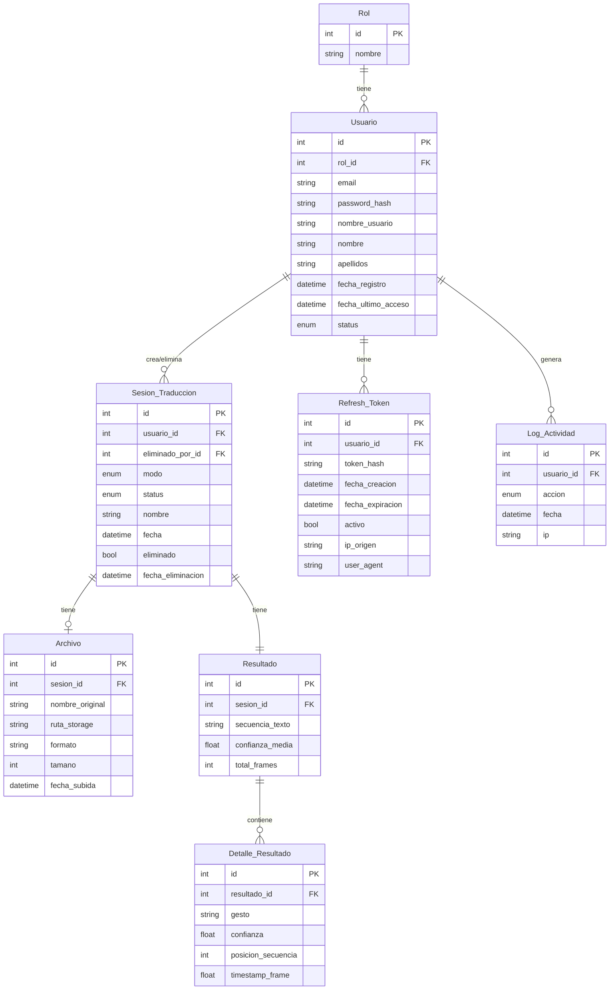

# Modelo de Datos — ASL Sign Language Translator

## 1. Diagrama Entidad-Relación

---

## 2. Tablas

### `Rol`

| Campo | Tipo | Descripción |
|---|---|---|
| id | PK | Identificador |
| nombre | string | `user` o `admin` |

Valores iniciales insertados en la migración `seed_roles`: `user` y `admin`.

---

### `Usuario`

| Campo | Tipo | Descripción |
|---|---|---|
| id | PK | Identificador |
| rol_id | FK → Rol | Rol del usuario |
| email | string | Email único |
| password_hash | string | Hash bcrypt de la contraseña |
| nombre_usuario | string | Nombre de usuario único |
| nombre | string | Nombre real |
| apellidos | string | Apellidos |
| fecha_registro | datetime | Fecha de creación de la cuenta |
| fecha_ultimo_acceso | datetime | Última vez que hizo login |
| status | enum | `ACTIVO`, `INACTIVO`, `BANEADO` |

Los valores del enum `status` son en mayúsculas tanto en PostgreSQL como en el modelo Python. Una inconsistencia de mayúsculas/minúsculas causaba errores 401 silenciosos en login.

---

### `Sesion_Traduccion`

| Campo | Tipo | Descripción |
|---|---|---|
| id | PK | Identificador |
| usuario_id | FK → Usuario | Usuario propietario |
| modo | enum | `IMAGEN_SUBIDA`, `FOTO_CAPTURADA`, `VIDEO_SUBIDO`, `VIDEO_GRABADO`, `LIVE_SESSION` |
| status | enum | `COMPLETADA`, `INTERRUMPIDA` |
| nombre | string nullable | Nombre personalizado editable por el usuario en el historial |
| fecha | datetime | Fecha de la sesión |
| eliminado | bool | Soft delete — el usuario elimina pero el admin sigue viendo |
| fecha_eliminacion | datetime | Fecha del soft delete |
| eliminado_por_id | FK → Usuario (SET NULL) | Quién eliminó la sesión |

**Semántica de `status`:**
- `COMPLETADA` — el flujo terminó de forma controlada, con o sin gestos detectados. Un resultado vacío (secuencia = `""`) es `COMPLETADA`, no `INTERRUMPIDA`.
- `INTERRUMPIDA` — desconexión abrupta en live session, excepción del modelo ML, o fallo de Storage con rollback.

La FK `eliminado_por_id` es `SET NULL` — si se borra el usuario que eliminó una sesión, el campo queda a `NULL` sin error. Corregido en migración `6fcdfc193fa3` (antes era `NO ACTION`).

---

### `Archivo`

| Campo | Tipo | Descripción |
|---|---|---|
| id | PK | Identificador |
| sesion_id | FK → Sesion_Traduccion | Sesión a la que pertenece |
| nombre_original | string | Nombre original del archivo subido por el usuario |
| ruta_storage | string | Ruta en Supabase Storage: `{usuario_id}/{sesion_id}/{uuid4}.{ext}` |
| formato | string | Extensión del archivo |
| tamano | int | Tamaño en bytes |
| fecha_subida | datetime | Fecha de subida |

Solo las sesiones de tipo imagen y vídeo tienen `Archivo`. Las sesiones live no generan archivo en Storage.

---

### `Resultado`

| Campo | Tipo | Descripción |
|---|---|---|
| id | PK | Identificador |
| sesion_id | FK → Sesion_Traduccion | Sesión a la que pertenece |
| secuencia_texto | string | Texto traducido completo (ej. `"HOLA MUNDO"`) |
| confianza_media | float | Media de confianza de todos los gestos detectados |
| total_frames | int | Número de frames procesados por el modelo (submuestreados, no totales) |

Toda sesión `COMPLETADA` tiene exactamente un `Resultado`. Si no se detectó ningún gesto, `secuencia_texto` es `""` y `confianza_media` es `0.0`.

---

### `Detalle_Resultado`

| Campo | Tipo | Descripción |
|---|---|---|
| id | PK | Identificador |
| resultado_id | FK → Resultado | Resultado al que pertenece |
| gesto | string | Letra o gesto detectado (ej. `"A"`, `"del"`, `"space"`) |
| confianza | float | Confianza del modelo para este gesto concreto |
| posicion_secuencia | int | Posición ordinal en la secuencia de traducción |
| timestamp_frame | float | Timestamp del frame en segundos (solo sesiones de vídeo y live) |

Un `Resultado` tiene un `Detalle_Resultado` por cada gesto detectado. Si `secuencia_texto` es `""`, no hay filas en `Detalle_Resultado`.

---

### `Refresh_Token`

| Campo | Tipo | Descripción |
|---|---|---|
| id | PK | Identificador |
| usuario_id | FK → Usuario | Usuario propietario |
| token_hash | string | Hash SHA-256 del refresh token — no bcrypt |
| fecha_creacion | datetime | Fecha de creación |
| fecha_expiracion | datetime | Caducidad (30 días) |
| activo | bool | `False` tras uso (rotation) o logout |
| ip_origen | string | IP del cliente en el momento de creación |
| user_agent | string | User-Agent del cliente para auditoría |

Se usa SHA-256 (hashlib) en lugar de bcrypt para el hash del token. bcrypt devolvía `verify()=True` siempre por un bug de compatibilidad con passlib, lo que hacía que cualquier token fuese válido.

El payload JWT incluye `jti` (UUID4) para garantizar unicidad de los refresh tokens aunque se creen en el mismo segundo.

---

### `Log_Actividad`

| Campo | Tipo | Descripción |
|---|---|---|
| id | PK | Identificador |
| usuario_id | FK → Usuario | Usuario que realizó la acción |
| accion | enum | `login`, `logout`, `registro`, `prediccion`, `eliminacion_sesion`, `cambio_contrasena`, `eliminacion_cuenta`, `cambio_status`, `eliminacion_usuario` |
| fecha | datetime | Fecha y hora de la acción |
| ip | string | IP del cliente |

La acción `eliminacion_cuenta` no genera log para evitar que la FK `usuario_id` quede apuntando a un usuario ya eliminado.

---

## 3. Índices

| Índice | Motivo |
|---|---|
| `Sesion_Traduccion.usuario_id` | Filtrar sesiones por usuario |
| `Resultado.sesion_id` | Join con sesión |
| `Detalle_Resultado.resultado_id` | Join con resultado |
| `Archivo.sesion_id` | Join con sesión |
| `Refresh_Token.usuario_id` | Buscar tokens por usuario |
| `Log_Actividad.usuario_id` | Filtrar logs por usuario |

---

## 4. Migraciones Alembic

| Revisión | Nombre | Descripción |
|---|---|---|
| `d450ccd6a497` | `initial_schema` | Creación de todas las tablas |
| `d74f5389a6b0` | `seed_roles` | INSERT de roles `user` y `admin` |
| `6031d16245ea` | `add_status_to_sesion_traduccion` | Enum `sesionestatus` + columna `status` con `server_default='COMPLETADA'` |
| `6fcdfc193fa3` | `fix_eliminado_por_id_set_null` | FK `eliminado_por_id` cambiada de `NO ACTION` a `SET NULL` |
| `7cfbcb0b8a8b` | `add_nombre_to_sesion_traduccion` | Columna `nombre VARCHAR(100) NULLABLE` para nombres personalizados de sesión |

**Entorno de producción:** las migraciones se aplican contra Supabase usando el Connection Pooler (puerto 6543, host `aws-0-eu-west-1.pooler.supabase.com`). La conexión directa (puerto 5432) solo tiene registro DNS IPv6 y no es alcanzable desde Railway.

**Entorno de tests:** la base de datos `asl_test` está en el mismo servidor PostgreSQL local que `asl_db`. Las migraciones deben aplicarse manualmente a `asl_test` tras cada migración nueva — no se ejecutan automáticamente.